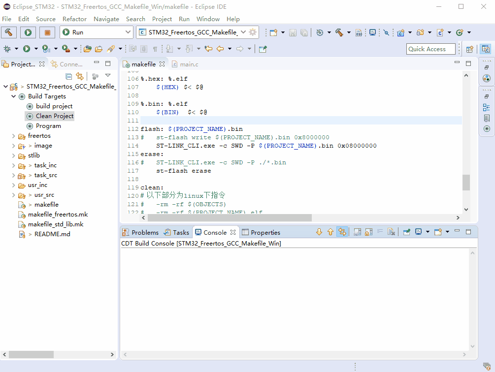

# Windows 搭建STM32开源开发环境    

## 意图   
MDK快到期了吧(雾)，开源至上才对哈。搭建一个不会受到律师函的免费开发环境(雾)。     

## 工具    
* [arm-none-eabi-gcc](https://developer.arm.com/tools-and-software/open-source-software/developer-tools/gnu-toolchain/gnu-rm/downloads "链接")<->gcc编译器     
* [make](https://nchc.dl.sourceforge.net/project/gnuwin32/make/3.81/make-3.81.exe)     <->为了更方便的执行编译灯操作，每次都敲指令编译不实在，可以写成makefile直接make一键编译。 配合Eclipse Build完美实现build,clean,program等操作（只要你会，不会就直接用就对了）。    
* Eclipse--编辑工具，下载C/C++版本。可用其他任意编辑软件替代(可选，推荐，stm32cubeIDE实际基于Eclipse,基于个人使用stmcubeIDE出现会删除用户文件bug，寄存器开发也不用到hal库，果断抛弃stm32cubeIDE)。      
* [stlink-utility](https://www.st.com/en/development-tools/stsw-link004.html "下载地址")<->st官方stlink下载工具，主要用到其ST-LINK_CLI.exe，用它来命令行下载程序。

* 安装完以上软件，请将安装路径添加到系统环境变量中。   如    
arm-none-eabi-gcc地址[C:\Program Files (x86)\GNU Tools Arm Embedded\9 2019-q4-major\bin]()
make 地址 [C:\Program Files (x86)\GnuWin32\bin]()   
stlink地址[C:\Program Files (x86)\STMicroelectronics\STM32 ST-LINK Utility\ST-LINK Utility]()

## 添加makefile 工程    
这里我移植了一个stm32  + stlib3.5 + Freertos 10.0.2 + makefile 的工程，直接拿去用吧，需要改的自己改，看看很容易理解。 

## 使用Eclipse
* Eclipse使用前需要设置一个workspace的工作目录，这个目录用于管理多个工程了。总之把相同的工程放同一个workspace统一处理。    
* 添加工程到Eclipse.点击File->import...，把自己的makefile工程目录添加进去即可。   
* 配置编译选项，简单来说执行哪个指令。在选择的工程下，右键->Build Targets -> Create。来创建编译选项。这里我一般用到3个常用的编译选项。   
	1.工程编译   make.exe all    
	2.清除工程   make.exe clean     
	3.下载工程到目标硬件 make.exe flash  

	
* 工程中忽略某些不必要的文件。Eclipse会将工程所有文件显示，这样编译下来会出现一堆生成文件，对我们来说是不必要看到的，所以把它过滤掉整个工程就干净多了。[参考这里](https://www.cnblogs.com/jhj117/p/7195893.html)

